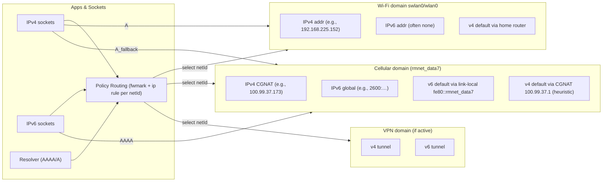

# Android per-network routing domains (IPv6 exclusive on cell)

This doc captures the per-network “exclusive domain” model and an overlay based on the device observed during testing.

## Model

Notes

- Each active network has its own routing domain; sockets are steered per‑flow.
- IPv6 is commonly provisioned only on the cellular PDN; the v6 default gateway is link‑local on the iface.
- On managed devices (e.g., Knox), routing tables and netlink may be hidden; detection uses layered fallbacks.

## Overlay (example from this device)

- Wi‑Fi: `swlan0` IPv4 `192.168.225.152`
- Cellular: `rmnet_data7` IPv4 `100.99.37.173`, IPv6 `2600:1007:...`
- Default v4: `100.99.37.1` (derived)
- Default v6: not readable under policy; egress iface hint: `rmnet_data7`

Captured: 2025‑08‑09
